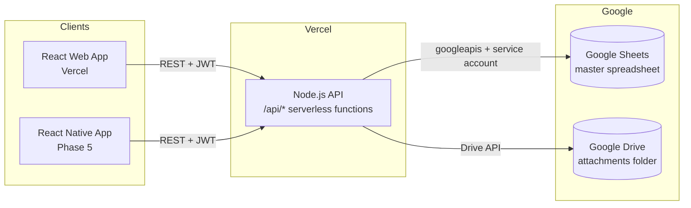

# 02 — Technical Requirements Document (TRD)

**Project:** ZOTO SYSTEM — Sales CRR
**Version:** 1.0 (Draft)
**Date:** 17 July 2026
**Status:** 🟡 Draft — pending review

---

## 1. Stack Decision

| Layer | Technology | Notes |
|-------|-----------|-------|
| Web frontend | **React.js 18 + Vite + TypeScript** | SPA; React Router; TanStack Query for server state |
| Mobile (Phase 5) | **React Native (Expo)** | Reuses the same REST API and shared types |
| Backend API | **Node.js 20 + Express (TypeScript)** | Deployed as Vercel serverless functions |
| Database | **Google Sheets** | One master spreadsheet; accessed via `googleapis` with a service account |
| File storage | **Google Drive** | PO/invoice/LR/POD attachments; links stored in sheets |
| Hosting | **Vercel** | Web app + API in one monorepo deployment |
| Source control | **GitHub** | User will grant access; monorepo, `main` = production |

**Why Node.js only (not Node + Python):** The user delegated this choice. A single runtime keeps the Vercel deployment simple (one build), shares TypeScript types between web/mobile/API, and the official `googleapis` Node client fully covers Sheets + Drive. Python adds a second toolchain with no capability we need. If Python-specific work appears later (heavy reporting, ML), it can be added as a separate Vercel serverless function without re-architecture.

## 2. Architecture



**Rule: clients never touch Google Sheets directly.** All reads/writes go through the API. This gives us validation, ID generation, role checks, and a single writer to reduce race conditions.

## 3. Repository Layout (monorepo)

```
zoto-system/
├── apps/
│   ├── web/                  # React + Vite SPA
│   │   └── src/
│   │       ├── components/   # Layout, DataTable, SlideOverForm, ToggleGroup...
│   │       ├── modules/      # one folder per module (order-punch, sale-order, ...)
│   │       ├── lib/          # api client, auth, hooks
│   │       └── theme/        # design tokens from 04-UIUX-BRIEF
│   ├── api/                  # Node.js Express app → Vercel functions
│   │   └── src/
│   │       ├── routes/       # /orders, /masters, /auth, /uploads
│   │       ├── services/     # sheets.ts (Sheets client), drive.ts, ids.ts
│   │       ├── middleware/   # auth, role guard, error handler
│   │       └── schema/       # zod validators per sheet (mirrors 05-BACKEND-SCHEMA)
│   └── mobile/               # Phase 5 — Expo app
├── packages/
│   └── shared/               # TypeScript types + status enums + column maps
├── docs/                     # these 6 documents
├── package.json              # npm workspaces
└── vercel.json
```

## 4. Google Sheets as a Database — Constraints & Mitigations

| Constraint | Impact | Mitigation |
|------------|--------|------------|
| Rate limits (~300 read/min, ~300 write/min per project) | Bursty list views could throttle | API-side in-memory cache (30–60 s TTL) per sheet; `?refresh=true` bypass wired to the UI Sync button |
| No transactions | Two users completing the same record could double-write | Single API writer; optimistic concurrency via `ROW_VERSION` column — reject write if version changed |
| No joins/indexes | Cross-sheet lookups are manual | API composes joins in memory; masters cached aggressively |
| Row limit ~10M cells | Long-term growth | One spreadsheet per fiscal year if needed (config-driven spreadsheet ID) |
| Manual edits possible | Team can fix data directly in Sheets (a feature!) | API treats sheet as source of truth on every cache refresh; all columns validated leniently on read |

### 4.1 Data access pattern

- Each sheet tab = one table. **Row 1 = headers** exactly as defined in [05-BACKEND-SCHEMA.md](05-BACKEND-SCHEMA.md).
- `services/sheets.ts` exposes `readTable(tab)`, `appendRow(tab, obj)`, `updateRow(tab, id, patch)` mapping objects ↔ header columns by name (order-independent, so the user can reorder columns safely).
- **ID generation:** `ids.ts` issues IDs like `ORD-202607-0001` using a `COUNTERS` tab with read-increment-write; retried on version conflict.
- Timestamps written in `DD/MM/YYYY, hh:mm:ss am/pm` display format **plus** an ISO column for sorting (current app shows `15/07/2026, 02:20:52 pm`).

## 5. API Design (REST)

Base: `/api/v1`. JSON everywhere. > DRAFT — final field names follow schema reconciliation.

| Endpoint | Method | Purpose |
|----------|--------|---------|
| `/auth/login` | POST | Email (+ Google Sign-In token, see §6) → JWT with role |
| `/masters/customers` (also `transports`, `goods`, `billing-strategies`) | GET | Cached master lists for dropdowns |
| `/masters/customers` | POST | Inline "Add New Customer" from Order Punch — writes directly into the Customer Master sheet, no approval step (§03-APP-FLOW.md §4 Tab 2) |
| `/masters/goods` | POST | Inline "Add New Part" from Order Punch — writes directly into the FG Master sheet |
| `/orders/latest?custId=` | GET | Returns the most recent order for a customer, for the "Shipping = Same as Previous Order" autofill (§03-APP-FLOW.md §4 Tab 3) |
| `/orders` | POST | Create order (Punch) |
| `/orders?stage=PDI&status=PENDING` | GET | Stage queues (powers every module list) |
| `/orders/:id` | GET | Full order + all stage records (timeline) |
| `/orders/:id/stages/:stage` | POST | Complete a stage (writes stage row, advances CURRENT_STAGE) |
| `/orders/:id/remarks` | GET/POST | Remarks module |
| `/samples` | GET/POST | Sample module |
| `/uploads` | POST | Multipart → Google Drive, returns file link |

Conventions: role guard per stage endpoint; every write records `CREATED_BY`/`UPDATED_BY` (JWT email) and timestamps; errors as `{ error: { code, message } }`.

## 6. Authentication

> DRAFT — to confirm with user. Recommended: **Google Sign-In** (team already lives in Google Workspace) validated against a `USERS` tab (email → role). Alternative if simpler is wanted: email + password hash in `USERS` tab. Either way the API issues a JWT (7-day expiry) consumed by web and mobile.

## 7. File Attachments

1. Client uploads file to `POST /uploads` (limit 10 MB, PDF/JPG/PNG).
2. API streams it to a Drive folder (`ZOTO-ATTACHMENTS/<year>/<order-id>/`), sets link-sharing to domain-restricted.
3. Drive `webViewLink` stored in the sheet cell; UI renders it as the attachment chip (as in current app's PDF box).

## 8. Environments & Deployment

| Env | Branch | URL | Spreadsheet |
|-----|--------|-----|-------------|
| Preview | PR branches | `*.vercel.app` previews | TEST spreadsheet (copy) |
| Production | `main` | production Vercel domain | LIVE spreadsheet |

**Env vars (Vercel):** `GOOGLE_SERVICE_ACCOUNT_KEY` (JSON, base64), `SPREADSHEET_ID`, `DRIVE_FOLDER_ID`, `JWT_SECRET`, `ALLOWED_ORIGIN`.

**Setup steps (Phase 0):** create GCP project → enable Sheets + Drive APIs → create service account → share the spreadsheet and Drive folder with the service-account email (editor).

## 9. Non-Functional Requirements

- **Performance:** list view p95 < 2 s with warm cache; form save < 3 s.
- **Concurrency:** last-write-wins prevented by `ROW_VERSION`; user shown "record changed, refresh" on conflict.
- **Security:** service-account key only in Vercel env; CORS locked to app origin; JWT on every route except login; role checks server-side.
- **Auditability:** no destructive deletes — rows get `STATUS=CANCELLED`, never removed by the API.
- **Browser support:** Chrome/Edge current; 1280px+ primary (current app is desktop-first), responsive down to tablet.
