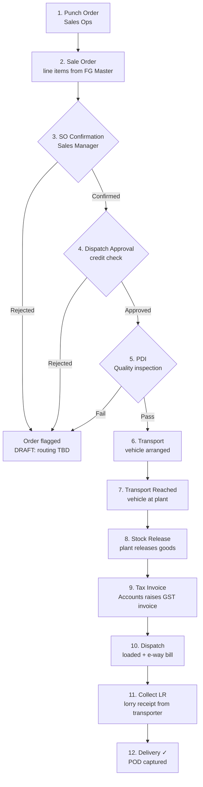

# 03 — Application Flow

**Project:** ZOTO SYSTEM — Sales CRR
**Version:** 1.1 — Order Punch redesigned to capture full item list (17 Jul 2026)
**Status:** 🟡 Order Punch flow (§4) confirmed including advanced autofill/self-service master creation. Per-stage forms for stages 3–12 (§5) still DRAFT pending screenshots.

---

## 1. Navigation Model (✅ confirmed from screenshots)

```
Login → Home (icon rail) → SALES CRR (module card grid, 14 cards)
      → Module list (Pending/Completed) → Slide-over form (multi-tab stepper)
```

- **Left icon rail** (fixed): Home, SALES CRR (basket icon, red highlight + tooltip when active), Desktop/Screens, Team/Users, Tables, two List views, Info, Feedback, App grid. > DRAFT — exact destinations of the other rail icons to confirm.
- **Top bar** (fixed): hamburger, app logo + name "SALES CRR-ADC-V5", centered global search ("Search SALES CRR"), sync status text ("Sync complete") + refresh button with dropdown, user avatar.
- **Breadcrumbs** under the top bar: `SALES CRR > Order Punch Pending > Pending Order Punch`.

## 2. Home — SALES CRR Module Grid (✅ confirmed)

14 cards in a 4-column grid, each = icon + label, in this order:

| Row | Cards |
|-----|-------|
| 1 | Punch Order · Sale Order · SO Confirmation · Dispatch Approval |
| 2 | PDI · Transport · Transport Reached · Stock Release |
| 3 | Tax Invoice · Dispatch · Collect LR · Delivery |
| 4 | Remarks · Sample |

Clicking a card opens that module's **Pending list**.

## 3. Module List Pattern (✅ confirmed via "Pending Order Punch")

Every pipeline module uses the same list layout:

- **Header row:** breadcrumbs; right side: `+` (new record — only on Punch Order; other stages act on existing orders), red **Completed** toggle button, filter icon, checkbox/select icon.
- **Left panel:** customer filter — "All" (active = red tint) + one row per customer with a count badge (e.g., "Shobha Trading 2").
- **Table columns** (Order Punch confirmed): `Status | Timestamp | Tally | Order Type | Payment Type | Customer Name | Buyer GSTIN No. | Pref… (horizontal scroll for more)`.
  - Timestamp format: `15/07/2026, 02:20:52 pm`
  - Tally values: `Tally 1 (Registered)` / `Tally 2 (Unregistered)`
- **Search** in top bar becomes module-scoped ("Search Pending Order Punch").
- Row click → record detail view (see §3.1).

### 3.1 Record Detail View ✅ (confirmed)

Full-page, replaces the list. Breadcrumb extends with the record's customer name: `SALES CRR > Order Punch Pending > Pending Order Punch > {Customer Name}`. Top right: Edit (pencil), **Delete** (red), Prev/Next arrows to page through records without going back to the list.

**Left rail card:** Record ID (e.g. `PNCH-dd8edb5b`), timestamp, and quick-action icons to related screens — e.g. "Add Discounts on Sale Order…", "Update Log" (jumps to that record's remarks/audit trail).

**Two-column read-only layout, grouped into sections:**

*Left column:*
- **Purchase Order Details** — PO No., Date, Attachment, Remarks (from Tab 1)
- **Billing Address** — Address Line 1/2 (with a map-pin icon linking to the location), State, Pin Code, Country, **Is Shipping Address Same** (Yes / No / Same as Previous Order)
- **Shipping Address** — Address Line 1/2, State, Pin Code, Country
- **GST Details** — Invoice Discount (₹), **Basic Amount**, **Tax Amount**, **Total Amount** — auto-calculated by summing all line items (matches the backend's existing GST split logic)

*Right column:*
- **Order Details** — Tally (fixed: Tally 1 Registered), Order Type, Payment Type
- **Seller Details** — Branch Name, Seller GSTIN, Email, Contact No. (with call/chat quick-icons), Address, State, Pin Code, Country — this is ZOTO's own selling-entity info, a fixed/config value (single firm in v1) rather than per-order input
- **Buyer Details** — Customer Name, Business Segment, Type of Customer, Buyer GSTIN, Contact No. (call/chat icons), Payment Terms, This Order Payment Terms, Contact Person Name + Contact No., Sale Staff Name, Order Given By, Ship to Consignee (Yes/No)
- **Logistics Details** — Preferred Delivery Mode, Transportation Mode, Freight Paid By, Freight Applicable on Invoice (Y/N), Preferred Transporter ID (linked to the Transport Master record), Transporter Name/Type/PAN/Contact (call/chat icons), Transporter Person Name + Contact, Transporter Address (map-pin icon)

*Full width, bottom:*
- **Order Punch Parts** — item table (count badge, e.g. "1") with Part No., Old Part No., Part Name, Part Description, Segment… (horizontal scroll) and an **Expand** link for the full item detail

> Note: GST % in the totals currently derives from each item's FG Master `GST_SLAB_PCT` (already implemented in the backend). Once a real Billing Strategy Master entry is added and tested, confirm whether GST % should instead (or additionally) come from the strategy record — flagging to verify during first live test, not blocking the build.

## 4. Order Punch Form (✅ confirmed — advanced redesign, not a copy of the reference app)

Right-side slide-over over the list, with header: ✕ close, title "Order Punch Form", buttons `< Prev` (from tab 2 onward) / `Cancel` / `Next >` (`Save` on the last tab) — red primary button. Tab bar with red underline on the active tab.

**Architecture decision (locked 17 Jul 2026):** Order Punch now captures the **full item list**, not just PO/buyer info. [Sale Order](#5-end-to-end-pipeline-flow) is downgraded from "build the item list" to a **review/pricing-confirmation step** on the items already captured here — see §5.

### Tab 1 — Purchase Order Details ✅
| Field | Type | Rules |
|-------|------|-------|
| Purchase Order No. | text | required (red outline when empty) |
| Purchase Order Date | date (mm/dd/yyyy picker) | required |
| Purchase Order Attachment | file (PDF) | optional |
| Purchase Order Remarks | text | optional |
| Other Order Attachment | file (PDF) | optional |

### Tab 2 — Order Details ✅ (redesigned)

**Order-level fields:**
| Field | Type | Rules |
|-------|------|-------|
| Order Type * | toggle: **Order Incoming** / Order Outgoing | required |
| Payment Type * | toggle: Credit / **Advance** | required |
| Advance Payment (%) * | number with % prefix | shown only when Payment Type = Advance; 0–100; out-of-range shows ⚠ "This entry is invalid" |
| Tally Book | fixed: `Tally 1 (Registered)` | this system is Tally 1 only — not user-editable, shown read-only for confirmation |

**Buyer section — Existing/New self-service pattern:**
| Field | Type | Behavior |
|-------|------|----------|
| Customer Type * | toggle: Existing / New | |
| → if Existing: Customer ID * | searchable dropdown ← Customer Master | selecting auto-fills Customer Code, Name, GSTIN, addresses, payment terms |
| → if New: **Add New Customer** | inline mini-form (Name, Address, GSTIN, contact…) | on submit, writes a new row **directly into Customer Master** and selects it for this order — no separate approval step |
| Client Classification * | toggle: Existing / New / Prospective | required |

**Item(s) section — repeatable, one block per line item, same Existing/New pattern:**
| Field | Type | Behavior |
|-------|------|----------|
| Part Type * | toggle: Existing / New | |
| → if Existing: Part Code Availability * | toggle: Available New / Available Old / Not Available | |
| → → if Available New/Old: ID * | searchable dropdown ← FG Master | selecting auto-fills Part Code, Part Name, Part Description |
| → → if Not Available, or Part Type = New: **Add New Part** | inline mini-form (Part Name, Description, Segment, Category, Paint, HSN, GST %…) | on submit, writes a new row **directly into FG Master** and selects it |
| Quantity * | numeric stepper (+/-) | quantity of this part received on the order |
| UOM * | dropdown | `KGS, MTR, NOS, UNT, PCS, PAC, LTR, SET, BDL, BAG, BOX, ROL, DRM, GRM, FET` |
| Remarks | text | optional, per line |
| **+ Add another item** | button | appends another item block; order must have ≥1 item to save |

### Tab 3 — Billing Address ✅ (redesigned)
| Field | Type | Behavior |
|-------|------|----------|
| Billing Address, Billing State, Billing Pin Code, Billing Country | text (editable) | auto-filled from the selected customer's record once a customer is chosen on Tab 2; user can override |
| **Is Shipping Address Same** * | 3-way toggle: **Yes** / No / **Same as Previous Order** | see below |
| Shipping Address, Shipping State, Shipping Pin Code, Shipping Country | text | `Yes` → copied from billing fields above (editable after copy); `No` → blank, manual entry; `Same as Previous Order` → auto-fetched from this customer's most recent order (needs a "latest order by customer" API lookup) |

### Tab 4 — Logistics Details ✅ (confirmed from screenshot)
| Field | Type | Behavior |
|-------|------|----------|
| Preferred Delivery Mode | toggle: Courier / Porter / **Transporter** / Cust. Vehicle / Local Vehicle | |
| Preferred Transportation Mode * | toggle: **Surface** / Air / Water | required |
| Freight Paid by * | toggle: Seller (ZOTO) / Customer | required |
| Preferred Transporter ID * | searchable dropdown ← Transport Master | required; selecting auto-fills the fields below (read-only) |
| Transporter Type, Transporter Contact No., Transporter Person Name, Transporter Person Contact No., Transporter Address | read-only, auto-filled | sourced live from the selected Transport Master row |
| Previous Invoice Parts | reference table (Timestamp, Part No., Old Part No., Part Name, "View (N)") | history of what's been billed under this part code before — nice-to-have, not required for v1 save |

Final action on Tab 4: **Save** → order + all items written in one transaction; record appears in Pending Order Punch, `CURRENT_STAGE = Punch`.

## 5. End-to-End Pipeline Flow (DRAFT — structure inferred; per-stage forms to confirm)



**Queue hand-off rule:** completing stage N sets that stage's record `COMPLETED` and creates a `PENDING` record in stage N+1, carrying Order ID, customer, and Tally book forward. Each module's list therefore only shows orders currently at its stage.

### Per-stage completion forms (all DRAFT — single-screen forms unless screenshots show otherwise)

| Stage | Expected inputs on completion |
|-------|------------------------------|
| Sale Order | **Review only** — items already captured at Punch; add SO No. (auto), billing strategy dropdown (← Billing Strategy Master, pricing/discount applied per item), confirm/adjust pricing |
| SO Confirmation | Confirm / Reject toggle + remarks |
| Dispatch Approval | Approve / Reject toggle + credit remarks |
| PDI | Pass / Fail toggle, inspection report attachment |
| Transport | Transporter dropdown (← master), vehicle no., driver name/phone, freight amount |
| Transport Reached | Reached date-time, remarks |
| Stock Release | Per-line released qty, released-by |
| Tax Invoice | Invoice no. + date, taxable value, CGST/SGST/IGST, invoice PDF, Tally book confirm |
| Dispatch | Dispatch date-time, e-way bill no., loaded qty |
| Collect LR | LR no., LR date, LR copy attachment |
| Delivery | Delivered date, receiver name, POD attachment |

## 6. Cross-Cutting Modules (DRAFT)

- **Remarks:** list of remark entries (timestamp, order ID, stage, user, text); `+` adds a remark against any active order.
- **Sample:** separate mini-pipeline for sample requests (customer, product, qty, dispatch details, status Pending/Sent/Feedback). Screenshots pending.

## 7. States & Edge Cases

- **Empty queue:** table area empty (as in current app) with left panel showing "All".
- **Validation:** field-level inline errors; Next blocked until current tab valid.
- **Sync:** top-bar shows "Syncing…" during API calls → "Sync complete"; refresh button forces cache bypass.
- **Conflict:** if another user completed the record first, show "This record was updated — refreshing" and reload the queue.
