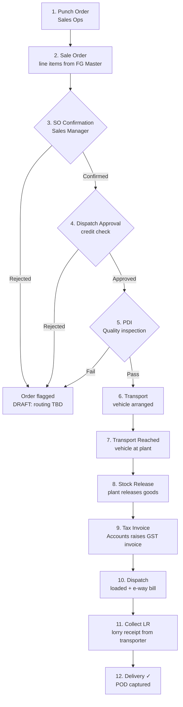

# 03 — Application Flow

**Project:** ZOTO SYSTEM — Sales CRR
**Version:** 1.0 (Draft)
**Status:** 🟡 Confirmed for screens seen in the 5 shared images; everything marked `DRAFT` awaits the user's remaining flow screenshots.

---

## 1. Navigation Model (✅ confirmed from screenshots)

```
Login → Home (icon rail) → SALES CRR (module card grid, 14 cards)
      → Module list (Pending/Completed) → Slide-over form (multi-tab stepper)
```

- **Left icon rail** (fixed): Home, SALES CRR (basket icon, red highlight + tooltip when active), Desktop/Screens, Team/Users, Tables, two List views, Info, Feedback, App grid. > DRAFT — exact destinations of the other rail icons to confirm.
- **Top bar** (fixed): hamburger, app logo + name "SALES CRR-ADC-V5", centered global search ("Search SALES CRR"), sync status text ("Sync complete") + refresh button with dropdown, user avatar.
- **Breadcrumbs** under the top bar: `SALES CRR > Order Punch Pending > Pending Order Punch`.

## 2. Home — SALES CRR Module Grid (✅ confirmed)

14 cards in a 4-column grid, each = icon + label, in this order:

| Row | Cards |
|-----|-------|
| 1 | Punch Order · Sale Order · SO Confirmation · Dispatch Approval |
| 2 | PDI · Transport · Transport Reached · Stock Release |
| 3 | Tax Invoice · Dispatch · Collect LR · Delivery |
| 4 | Remarks · Sample |

Clicking a card opens that module's **Pending list**.

## 3. Module List Pattern (✅ confirmed via "Pending Order Punch")

Every pipeline module uses the same list layout:

- **Header row:** breadcrumbs; right side: `+` (new record — only on Punch Order; other stages act on existing orders), red **Completed** toggle button, filter icon, checkbox/select icon.
- **Left panel:** customer filter — "All" (active = red tint) + one row per customer with a count badge (e.g., "Shobha Trading 2").
- **Table columns** (Order Punch confirmed): `Status | Timestamp | Tally | Order Type | Payment Type | Customer Name | Buyer GSTIN No. | Pref… (horizontal scroll for more)`.
  - Timestamp format: `15/07/2026, 02:20:52 pm`
  - Tally values: `Tally 1 (Registered)` / `Tally 2 (Unregistered)`
- **Search** in top bar becomes module-scoped ("Search Pending Order Punch").
- Row click → record detail / stage completion form. > DRAFT — detail view layout to confirm.

## 4. Order Punch Form (✅ confirmed, tabs 1–2; tabs 3–4 DRAFT)

Right-side slide-over over the list, with header: ✕ close, title "Order Punch Form", buttons `< Prev` (from tab 2 onward) / `Cancel` / `Next >` (red). Tab bar with red underline on the active tab.

### Tab 1 — Purchase Order Details ✅
| Field | Type | Rules |
|-------|------|-------|
| Purchase Order No. | text | required (red outline when empty) |
| Purchase Order Date | date (mm/dd/yyyy picker) | required |
| Purchase Order Attachment | file (PDF) | optional |
| Purchase Order Remarks | text | optional |
| Other Order Attachment | file (PDF) | optional |

### Tab 2 — Order Details ✅
| Field | Type | Rules |
|-------|------|-------|
| Order Type * | toggle: **Order Incoming** / Order Outgoing | required |
| Payment Type * | toggle: Credit / **Advance** | required |
| Advance Payment (%) * | number with % prefix | shown only when Payment Type = Advance; 0–100; out-of-range shows ⚠ "This entry is invalid" |
| CUST ID * (Buyer Details) | dropdown ← Customer Master | required; selecting fills buyer name/GSTIN |
| Client Classification * | toggle: Existing / New / Prospective | required |

> DRAFT — Tally book (Tally 1/Tally 2) appears in the list, so it is captured somewhere in this form; assumed on Tab 2. To confirm.

### Tab 3 — Billing Address (DRAFT)
Assumed: billing name/address auto-filled from Customer Master (editable), GSTIN, state + state code, place of supply.

### Tab 4 — Logistics Details (DRAFT)
Assumed: ship-to address, preferred transport (← Transport Master), expected delivery date, freight terms (Paid/To-Pay), delivery instructions. Final action: **Submit** → record appears in Pending Order Punch and (on completion) flows to Sale Order.

## 5. End-to-End Pipeline Flow (DRAFT — structure inferred; per-stage forms to confirm)



**Queue hand-off rule:** completing stage N sets that stage's record `COMPLETED` and creates a `PENDING` record in stage N+1, carrying Order ID, customer, and Tally book forward. Each module's list therefore only shows orders currently at its stage.

### Per-stage completion forms (all DRAFT — single-screen forms unless screenshots show otherwise)

| Stage | Expected inputs on completion |
|-------|------------------------------|
| Sale Order | SO No. (auto), line items table (FG, qty, rate, GST%), billing strategy dropdown |
| SO Confirmation | Confirm / Reject toggle + remarks |
| Dispatch Approval | Approve / Reject toggle + credit remarks |
| PDI | Pass / Fail toggle, inspection report attachment |
| Transport | Transporter dropdown (← master), vehicle no., driver name/phone, freight amount |
| Transport Reached | Reached date-time, remarks |
| Stock Release | Per-line released qty, released-by |
| Tax Invoice | Invoice no. + date, taxable value, CGST/SGST/IGST, invoice PDF, Tally book confirm |
| Dispatch | Dispatch date-time, e-way bill no., loaded qty |
| Collect LR | LR no., LR date, LR copy attachment |
| Delivery | Delivered date, receiver name, POD attachment |

## 6. Cross-Cutting Modules (DRAFT)

- **Remarks:** list of remark entries (timestamp, order ID, stage, user, text); `+` adds a remark against any active order.
- **Sample:** separate mini-pipeline for sample requests (customer, product, qty, dispatch details, status Pending/Sent/Feedback). Screenshots pending.

## 7. States & Edge Cases

- **Empty queue:** table area empty (as in current app) with left panel showing "All".
- **Validation:** field-level inline errors; Next blocked until current tab valid.
- **Sync:** top-bar shows "Syncing…" during API calls → "Sync complete"; refresh button forces cache bypass.
- **Conflict:** if another user completed the record first, show "This record was updated — refreshing" and reload the queue.
