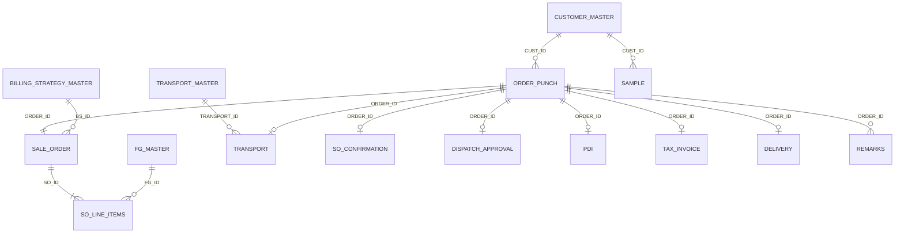

# 05 — Backend Schema (Google Sheets)

**Project:** ZOTO SYSTEM — Sales CRR
**Version:** 1.0 — **DRAFT drafted from screenshots + standard practice.**
**⚠ To reconcile:** the user will share the actual Google Sheet (edit access). Column names below then get updated to match the real headers, and this doc becomes the contract for the API's column maps (`packages/shared`).

**Update (2026-07-22) — ORDERS → ORDER_PUNCH:** the live transactions sheet's order-header tab was renamed `ORDERS` → `ORDER_PUNCH` and its columns given human-readable names (e.g. `PO_NO` → `Purchase_Order_No.`, `CUSTOMER_NAME` → `Cutomer_Name`), with grey section-header spacer columns and new **Seller Details** / **Consignee Details** sections. The API keeps its internal field names and translates to/from the real headers via `Backend/src/routes/orderPunchMap.ts` (`punchToSheet` / `punchFromSheet`), used on every ORDER_PUNCH read/write in `orders.ts`. Seller fields auto-fill from `SALLER_MASTER` (branch `ZOTO-001`) and buyer segment/contact from `CUSTOMER MASTER T1` on save. `ORDER_PUNCH` has no `CURRENT_STAGE` column, so reads synthesize `CURRENT_STAGE = "Punch"`.

**Update (2026-07-22) — Phase 2, SALE_ORDERS:** saving the Sale Order form (`POST /orders/:id/sale-order-form`) now creates a full `SALE_ORDERS` row — a copy of every punch order-header field + the carried `Invoice_Discount` + a generated `SALE_ORDER_ID` (`SO-` series) + `Sale Order No./Date/Attachment/Remarks` — and flips the `ORDER_PUNCH` status to `SALE ORDER`. `SALE_ORDERS` reuses the punch field names (`SALE_ORDER_MAP` overrides only `Invoice_Discount` + adds the SO fields; see `orderPunchMap.ts`). `GET /orders/:id/sale-order` reads it back for the detail view's Sale Order section. **Update (2026-07-22) — SALE_ORDER_ITEMS wired:** the user added item columns to `SALE_ORDER_ITEMS`, matching `ORDER_ITEMS`' exact column names (`FG_ID`, `PART_NO`, `PRICE`, `QTY`, …) plus `SALE_ORDER_ID`/`SALE_ORDER_ITEM_ID` link IDs. No header-translation map needed here — `POST /orders/:id/sale-order-form` now also copies each `ORDER_ITEMS` row for the order into `SALE_ORDER_ITEMS` as-is, adding `Timestamp`/`Useremail`/`SALE_ORDER_ID`/`SALE_ORDER_ITEM_ID` (`SOI-` counter series). Verified end-to-end against the live sheet.

---

## 0. Conventions (apply to every sheet)

- One spreadsheet, one tab per table. **Row 1 = exact headers below.**
- Every table starts with its **primary ID** column; transaction tables carry `ORDER_ID` as the foreign key linking all stages of one order.
- Standard audit columns on every transaction sheet (listed once here, appended to each table):
  `STATUS` (PENDING/COMPLETED/REJECTED/CANCELLED) · `CREATED_AT` (ISO) · `CREATED_AT_DISPLAY` (`DD/MM/YYYY, hh:mm:ss am/pm`) · `CREATED_BY` (email) · `UPDATED_AT` · `UPDATED_BY` · `ROW_VERSION` (int, optimistic locking)
- **ID formats:** `ORD-YYYYMM-####` (order), `SO-YYYYMM-####`, `INV-<series>-####`, `SMP-YYYYMM-####`, `CUST-####`, `TRN-####`, `FG-####`, `BS-##`. Issued by the API from the `COUNTERS` tab.
- Enum values stored as canonical text (e.g., `TALLY 1 (REGISTERED)`), matching what the UI displays.

---

## 1. Master Sheets

### 1.1 `CUSTOMER_MASTER`

Order Punch loads each selectable customer's billing address, state, PIN code and country directly from `CUSTOMER MASTER T1`; selecting the customer fills Tab 3 immediately. Legacy address/contact tabs are optional and never block the T1 lookup.

| Column | Type | Notes |
|--------|------|-------|
| CUST_ID | id | `CUST-0001`; shown in Order Punch dropdown ✅ |
| CUSTOMER_NAME | text | e.g., "Shobha Trading" ✅ |
| GSTIN | text(15) | Buyer GSTIN No. ✅ e.g., `07AETPJ8506M1ZT` |
| CLIENT_CLASSIFICATION | enum | EXISTING / NEW / PROSPECTIVE ✅ |
| CONTACT_PERSON / PHONE / EMAIL | text | |
| BILLING_ADDRESS / BILLING_STATE / BILLING_STATE_CODE / BILLING_PINCODE | text | GST place-of-supply |
| SHIPPING_ADDRESS / SHIPPING_STATE / SHIPPING_PINCODE | text | default ship-to |
| PAYMENT_TERMS_DAYS | number | credit days |
| CREDIT_LIMIT | number | used at Dispatch Approval |
| DEFAULT_TALLY_BOOK | enum | TALLY 1 (REGISTERED) / TALLY 2 (UNREGISTERED) |
| ACTIVE | bool | |

### 1.2 `TRANSPORT_MASTER`
| Column | Type |
|--------|------|
| TRANSPORT_ID | id `TRN-0001` |
| TRANSPORTER_NAME | text |
| GSTIN | text |
| CONTACT_PERSON / PHONE | text |
| CITY / ROUTES_SERVED | text |
| DEFAULT_FREIGHT_TERMS | enum PAID / TO_PAY |
| ACTIVE | bool |

### 1.3 `FG_MASTER` (Finished Goods)
| Column | Type |
|--------|------|
| FG_ID | id `FG-0001` |
| FG_NAME / DESCRIPTION | text |
| HSN_CODE | text |
| UOM | enum (NOS/KG/BOX/…) |
| GST_PERCENT | number |
| PACK_SIZE | text |
| STANDARD_RATE | number |
| ACTIVE | bool |

### 1.4 `BILLING_STRATEGY_MASTER`
| Column | Type | Notes |
|--------|------|-------|
| BS_ID | id `BS-01` | |
| STRATEGY_NAME | text | |
| TALLY_BOOK | enum | which book invoices under this strategy go to |
| INVOICE_SERIES_PREFIX | text | e.g., `INV-A` |
| BILLING_ENTITY_NAME / GSTIN / ADDRESS | text | seller-side details on invoice |
| NOTES | text | |
| ACTIVE | bool | |

### 1.5 `USERS`
| Column | Type |
|--------|------|
| EMAIL | text (key) |
| NAME | text |
| ROLE | enum SALES_OPS / SALES_MANAGER / QUALITY / LOGISTICS / ACCOUNTS / ADMIN |
| ACTIVE | bool |
| PASSWORD | text — plain text, internal MVP only. Login rejects a row until this is set (`Backend/src/routes/auth.ts`). |
| MODULES | text — comma-separated module keys this doer can see (e.g. `punch-order,sale-order`, matching `Frontend/src/lib/modules.ts` `key`s). **Blank or `ALL` = unrestricted** (fail-open default, so existing rows aren't locked out). Read into the JWT at login (`modules: string[] \| "ALL"`), enforced server-side by `requireModule()` on `ordersRouter` and filtered client-side on the Module Home grid (`ModuleHome.tsx`). |
| CAN_DELETE | text — `Yes`/`TRUE`/`1` grants permission to bulk-delete orders via the Punch Order list's Select mode; **blank/anything else = no delete access** (fail-closed default, since this guards an irreversible action). Enforced server-side by `requireCanDelete` on `DELETE /orders` (`Backend/src/routes/orders.ts`) and gates whether the "Select" button even renders client-side. |

**Admin note (2026-07-20):** MODULES/CAN_DELETE are managed directly in this sheet, not through an in-app admin UI, per explicit user decision — add/edit these two columns per doer row as needed.

**Live application, AppSheet-style (2026-07-20 update):** sheet edits apply to already-logged-in users **without re-login**, matching how the legacy AppSheet "Permissions"/"UI" tabs behaved. Mechanics: the backend re-reads USERS on every permission-gated request (`Backend/src/services/permissions.ts`, 15s cache) instead of trusting JWT claims, and the frontend polls `GET /auth/me` every 60s to refresh what the UI shows/hides. Flipping `ACTIVE` to anything but `Yes` (or deleting the row) logs that user out within a minute. Expected propagation: seconds for API enforcement, ≤1 minute for the visible UI.

**MODULES accepts the old sheet's friendly process names**, not just internal keys — `Order Punch`, `Sale Order`, `SO Confirmation`, `LR Collection`, etc. are aliased case-insensitively (spaces/hyphens ignored) to module keys in `permissions.ts`. `Admin` anywhere in the list = full access; navigation groupings from the old Process column (`Home`, `Sales CRR`, `Masters`, `Dashboard`) are ignored rather than treated as modules, so old Process values can be pasted in mostly as-is.

### 1.6 `COUNTERS`
`COUNTER_KEY | LAST_VALUE` — API-managed ID sequences (e.g., `ORD-202607 → 27`).

---

## 2. Transaction Sheets (one per pipeline stage + audit columns from §0)

### 2.1 `ORDER_PUNCH` ✅ (fields confirmed from form screenshots; ⚠ items assumed)
| Column | Source tab |
|--------|-----------|
| ORDER_ID | auto |
| PO_NUMBER, PO_DATE, PO_ATTACHMENT_URL, PO_REMARKS, OTHER_ATTACHMENT_URL | Tab 1 ✅ |
| ORDER_TYPE (ORDER_INCOMING/ORDER_OUTGOING), PAYMENT_TYPE (CREDIT/ADVANCE), ADVANCE_PERCENT (0–100, blank if Credit) | Tab 2 ✅ |
| CUST_ID → + denormalized CUSTOMER_NAME, BUYER_GSTIN | Tab 2 ✅ (copied from master at punch time) |
| CLIENT_CLASSIFICATION | Tab 2 ✅ |
| TALLY_BOOK | list shows it ✅; capture tab ⚠ |
| BILLING_NAME, BILLING_ADDRESS, BILLING_STATE, BILLING_STATE_CODE, BILLING_GSTIN | Tab 3 ⚠ |
| SHIP_TO_ADDRESS, PREFERRED_TRANSPORT_ID, EXPECTED_DELIVERY_DATE, FREIGHT_TERMS, DELIVERY_INSTRUCTIONS | Tab 4 ⚠ (list has a "Pref…" column ✅) |
| CURRENT_STAGE | enum of the 12 stages — the pipeline pointer |

### 2.2 `SALE_ORDER`
`SO_ID | ORDER_ID | SO_DATE | BS_ID (billing strategy) | TOTAL_QTY | TOTAL_VALUE | SO_REMARKS`

### 2.3 `SO_LINE_ITEMS`
`LINE_ID | SO_ID | ORDER_ID | FG_ID | FG_NAME | HSN_CODE | QTY | UOM | RATE | GST_PERCENT | LINE_VALUE`

### 2.4 `SO_CONFIRMATION`
`ORDER_ID | SO_ID | DECISION (CONFIRMED/REJECTED) | DECISION_REMARKS | DECIDED_BY | DECIDED_AT`

### 2.5 `DISPATCH_APPROVAL`
`ORDER_ID | DECISION (APPROVED/REJECTED) | CREDIT_REMARKS | OUTSTANDING_AMOUNT ⚠ | DECIDED_BY | DECIDED_AT`

### 2.6 `PDI`
`ORDER_ID | RESULT (PASS/FAIL) | INSPECTION_DATE | INSPECTOR | REPORT_ATTACHMENT_URL | PDI_REMARKS`

### 2.7 `TRANSPORT`
`ORDER_ID | TRANSPORT_ID | TRANSPORTER_NAME | VEHICLE_NO | DRIVER_NAME | DRIVER_PHONE | FREIGHT_AMOUNT | FREIGHT_TERMS | EXPECTED_ARRIVAL_DATE`

### 2.8 `TRANSPORT_REACHED`
`ORDER_ID | REACHED_AT | VEHICLE_CONDITION_REMARKS`

### 2.9 `STOCK_RELEASE`
`ORDER_ID | RELEASE_DATE | RELEASED_BY | RELEASE_REMARKS` (+ per-line released qty in `STOCK_RELEASE_LINES ⚠`: `LINE_ID | ORDER_ID | FG_ID | RELEASED_QTY`)

### 2.10 `TAX_INVOICE`
`ORDER_ID | INVOICE_NO | INVOICE_DATE | BS_ID | TALLY_BOOK | TAXABLE_VALUE | CGST | SGST | IGST | TOTAL_VALUE | INVOICE_ATTACHMENT_URL`

### 2.11 `DISPATCH`
`ORDER_ID | DISPATCHED_AT | EWAY_BILL_NO | LOADED_QTY | DISPATCH_REMARKS`

### 2.12 `COLLECT_LR`
`ORDER_ID | LR_NO | LR_DATE | LR_ATTACHMENT_URL | LR_REMARKS`

### 2.13 `DELIVERY`
`ORDER_ID | DELIVERED_DATE | RECEIVER_NAME | POD_ATTACHMENT_URL | DELIVERY_REMARKS`

### 2.14 `REMARKS`
`REMARK_ID | ORDER_ID | STAGE | REMARK_TEXT | RAISED_BY | RAISED_AT | RESOLVED (bool) ⚠`

### 2.15 `SAMPLE` ⚠ (workflow screenshots pending)
`SAMPLE_ID | CUST_ID | CUSTOMER_NAME | FG_ID | QTY | REQUEST_DATE | SENT_DATE | TRANSPORT_DETAILS | FEEDBACK | SAMPLE_STATUS (REQUESTED/SENT/FEEDBACK_RECEIVED)`

---

## 3. Relationships

(Stages 7, 8, 10, 11 follow the same `ORDER_ID` 1-to-0/1 pattern; omitted from the diagram for readability.)

## 4. Reconciliation Checklist (when the user shares the real sheet)

- [ ] Match every tab name and header to this doc; update `packages/shared` column maps
- [ ] Confirm which columns are formulas in-sheet (API must never overwrite formula columns)
- [ ] Confirm Tally book capture point and allowed values
- [ ] Confirm line-items modeling (separate tab vs. columns in `SALE_ORDER`)
- [ ] Add TEST copy of the spreadsheet for preview deployments
